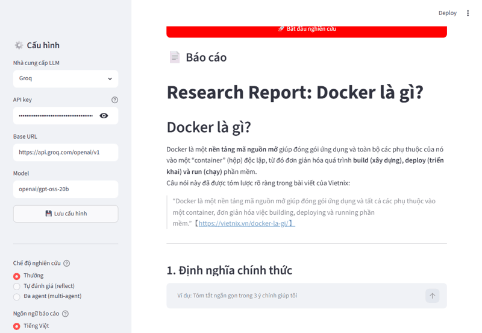
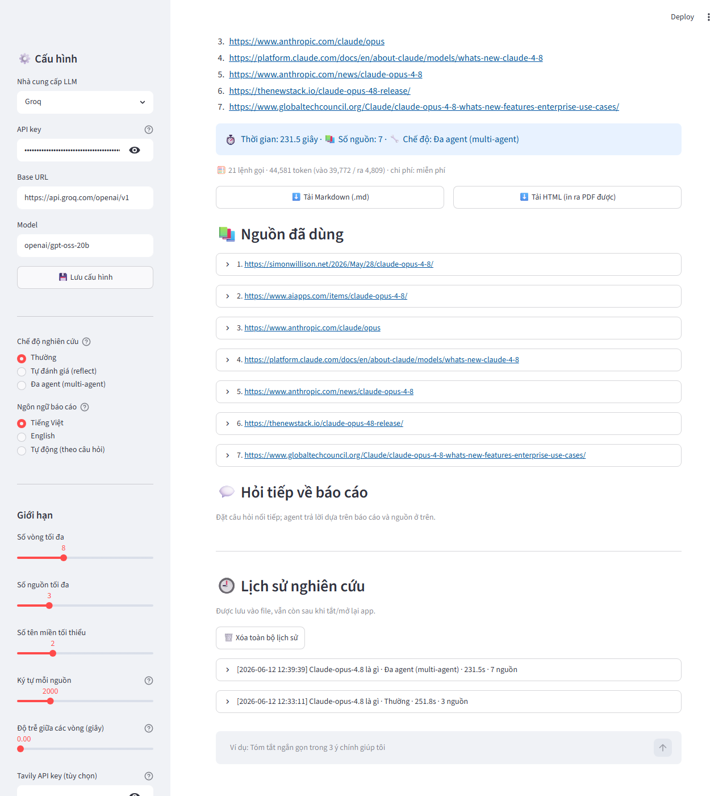
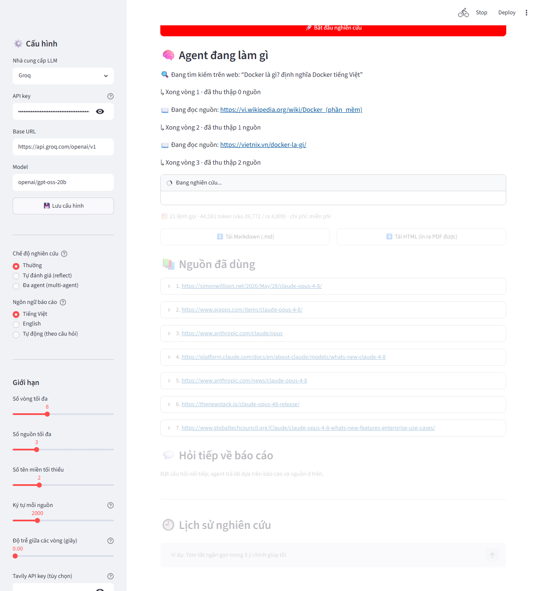
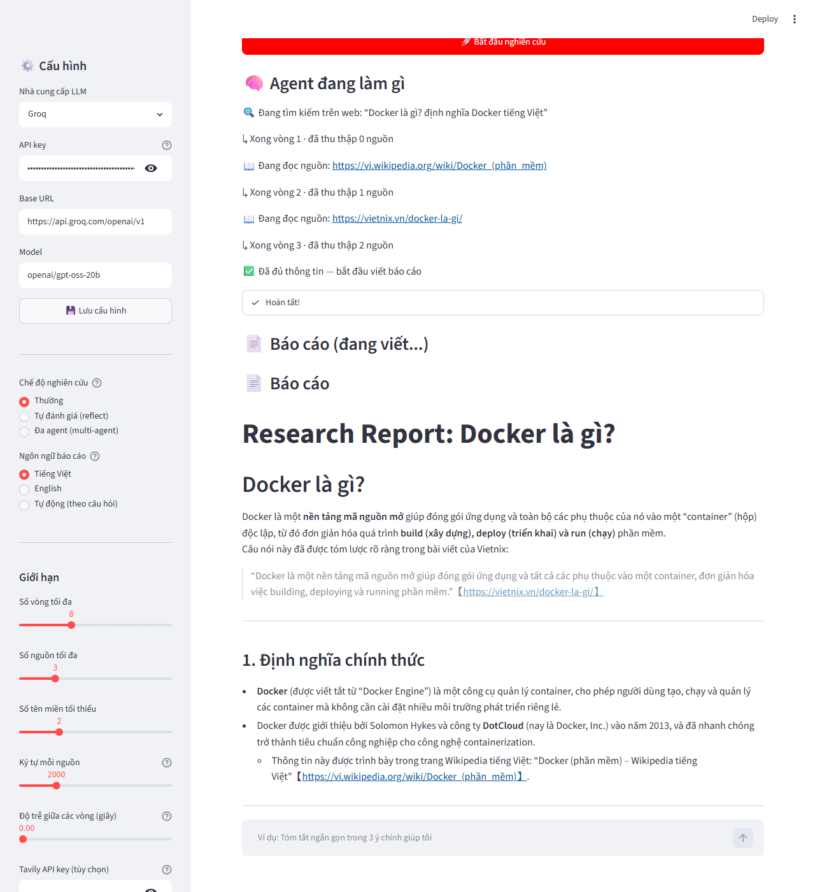

# research-agent 🔎🤖


**What is it?** An autonomous AI research agent. You ask a question; it searches
the web over multiple rounds, reads sources, decides on its own when it has
enough, and writes a **cited Markdown report** — so you can trust and verify it.

**Who is it for?** Anyone who needs to research a topic quickly (students,
developers, writers), and anyone learning **how AI agents actually work** under
the hood.

**What problem does it solve?** It turns "spend an hour reading 10 tabs" into
"ask once, get a grounded, cited summary" — while staying transparent about every
step it takes.

Runs from the **command line** or a **web UI** (Streamlit). Works with any
OpenAI-compatible LLM (Groq, Gemini, OpenAI, local Ollama).

## 📚 Documentation

| File | What it covers |
|---|---|
| [README.md](README.md) | This file — overview, install, usage (English) |
| [HUONG_DAN.md](HUONG_DAN.md) | Hướng dẫn sử dụng chi tiết cho người dùng (Tiếng Việt) |
| [TAI_LIEU_KY_THUAT.md](TAI_LIEU_KY_THUAT.md) | Tài liệu kỹ thuật: kiến trúc, module, luồng dữ liệu (Tiếng Việt) |
| [CONTRIBUTING.md](CONTRIBUTING.md) | How to contribute (conventions, tests) |

## 📸 Screenshots

The web UI (Streamlit) — configure a provider, ask a question, watch the agent's
steps in Vietnamese, and read the cited report:



| Home | Researching (live steps) | Cited report |
|---|---|---|
|  |  |  |

> The CLI offers the same capabilities (`research-agent "your question" -v`).

## How it works

```
question ─▶ Agent_Loop ─▶ decide: SEARCH / READ / FINISH
                │            │
                │            ├─ Search_Tool (web search)
                │            └─ Fetch_Tool  (download + extract text)
                ▼
          Synthesizer ─▶ cited Markdown Report ─▶ file + console summary
```

Key design idea: the **deterministic core** (loop control, budget enforcement,
citation validation, content truncation, domain filtering) is made of pure
functions, while the **unpredictable I/O** (LLM, search, fetch, file writes)
lives behind small interfaces. That makes the agent easy to read, test, and
reason about.

### Safety properties
- All web content is treated as **data, never instructions** (prompt-injection
  resistant via `wrap_untrusted`).
- The agent **always terminates** thanks to a finite research budget
  (max rounds / sources / seconds).
- Citations can only point to sources that were actually fetched.
- Web reads are restricted to search results and public HTTP(S) destinations;
  private, loopback, and link-local networks are blocked, including redirects.
- Local PDFs are opt-in: the agent can only read a file explicitly selected for
  the current run with `--pdf` (or the UI file picker). An approved PDF is
  listed as a user-provided source by filename and page count; temporary local
  paths are never included in the report.

### Efficiency & quality
- **Persistent fetch cache**: a URL read once is reused from disk across
  sessions (disable with `--no-cache`, configure with `--cache-dir`).
- **Parallel prefetch**: after each search the agent warms the cache by
  fetching the top results concurrently, so the subsequent READ actions are
  instant cache hits (tune with `--prefetch N`, `0` disables).
- **Optional LLM response cache**: with `--cache-llm`, identical prompts
  (common across reflection iterations and re-runs) reuse a cached response.
- **Recency awareness**: time-sensitive questions (e.g. "latest", a recent
  year) automatically steer the agent toward fresh sources and the `now`/news
  tools.
- **Source diversity**: encourages at least `--min-domains` distinct domains and
  never collects more than `--max-per-domain` pages from one site. If the model
  tries to finish too early, the agent auto-reads one more new-domain source.
- **Source-quality signals**: ranks official/academic (`.gov`/`.edu`/`.int`)
  domains highest, then a curated set of established/reputable sources (major
  news, reference works, scholarly publishers), above the general web, and below
  social or user-generated platforms. Each fetched source is labeled by its
  domain type and the amount of extractable evidence. These labels are
  transparent heuristics, not fact-checks. Extend the built-in lists with your
  own domains via `--reputation-file` (or `RESEARCH_AGENT_REPUTATION_FILE`).
- **Smart retry/backoff**: honors a provider `Retry-After` header on 429/503,
  otherwise uses capped exponential backoff.

### Agent tools
The agent chooses among these tools on each step via native function-calling:
- **search** — run a web search.
- **read** — fetch and read a source URL.
- **calculate** — evaluate a safe arithmetic expression (no `eval`; AST-based,
  allow-listed operators) for precise numbers in the report.
- **now** — get the current date/time (for "latest"/"today"/recency questions).
- **get_weather** — retrieve current weather from wttr.in.
- **get_stock** — retrieve the latest stock/index quote (price, day range,
  volume) from Yahoo Finance's public endpoint (no API key).
- **get_wikipedia** — fetch an encyclopedic summary of a topic from Wikipedia
  (no API key) for definitions and background.
- **arxiv_search** — search arXiv and read academic-paper abstracts (no key).
- **convert** — convert units or currencies (e.g. `10 km to miles`,
  `100 USD to EUR`); currencies use live ECB rates (no key).
- **get_news** — find recent stories about a topic via Hacker News (no key).
- **get_github** — look up a GitHub repository's metadata (stars, language,
  license, latest release).
- **read_pdf** — read a PDF explicitly selected by the user for the current run.
- **finish** — stop and synthesize the cited report.

### Agent modes
- **Native tool-calling**: the model selects actions via real function-calling
  (not JSON-mode prompting), which is more reliable. The provider also recovers
  gracefully when open models emit a tool call as plain text (a known quirk of
  some Llama/OSS models on Groq).
- **Reflection** (`--reflect`): after drafting, the agent critiques its own
  report, scores it, and re-researches the gaps until it's good enough or hits
  `--reflect-iterations`.
- **Multi-agent** (`--multi-agent`): a planner splits the question into
  sub-questions, a researcher gathers sources for each, and a writer synthesizes
  one cited report.
- **Long-term memory** (`--memory`): recalls relevant past research from a local
  store as trusted background context before a run, and remembers the result
  afterwards (configure the file with `--memory-file`).

> Tip: on providers with a low tokens-per-minute limit (e.g. Groq free tier),
> lower `RESEARCH_AGENT_PER_SOURCE_CHARS` (e.g. 1500-2500) and `--max-sources`
> so each request stays under the limit.

## Install

For a reproducible development environment that matches CI, install
[uv](https://docs.astral.sh/uv/) and use the committed lockfile:

```powershell
uv sync --all-extras
```

Or use pip:

```powershell
python -m pip install -e ".[dev,ui]"
```

For direct PDF export, also install the optional `pdf` extra (it pulls in
`fpdf2`); for Word export, install the `docx` extra (`python-docx`):

```powershell
python -m pip install -e ".[pdf,docx]"
```

To permit one local PDF in a CLI run, opt in explicitly:

```powershell
research-agent "Summarize this document" --pdf C:\Documents\report.pdf
```

## Configure

Set your LLM provider credentials via environment variables. The agent works
with any OpenAI-compatible API. Recommended free options:

**Groq** (fast, generous free tier, recommended for live use):
```powershell
$env:RESEARCH_AGENT_API_KEY  = "gsk_...(your Groq key)"
$env:RESEARCH_AGENT_BASE_URL = "https://api.groq.com/openai/v1"
$env:RESEARCH_AGENT_MODEL    = "openai/gpt-oss-20b"
```

**Gemini** (via its OpenAI-compatible endpoint; small free tier):
```powershell
$env:RESEARCH_AGENT_API_KEY  = "AIza...(your Gemini key)"
$env:RESEARCH_AGENT_BASE_URL = "https://generativelanguage.googleapis.com/v1beta/openai/"
$env:RESEARCH_AGENT_MODEL    = "gemini-2.5-flash-lite"
```

| Variable | Required | Default |
|---|---|---|
| `RESEARCH_AGENT_API_KEY` | ✅ | — |
| `RESEARCH_AGENT_BASE_URL` | | `https://api.openai.com/v1` |
| `RESEARCH_AGENT_MODEL` | | `gpt-4o-mini` |
| `RESEARCH_AGENT_SEARCH_API_KEY` | | — |
| `RESEARCH_AGENT_SEARCH_ENDPOINT` | | — (defaults to free DuckDuckGo search) |
| `RESEARCH_AGENT_BLOCKED_DOMAINS` | | (none) |
| `RESEARCH_AGENT_MAX_ROUNDS` / `..._SOURCES` / `..._SECONDS` | | `8` / `12` / `180` |

## Run

```powershell
research-agent "What are the tradeoffs of RAG vs fine-tuning?" -o report.md -v
```

Web search uses **DuckDuckGo by default** (no API key needed). To use a custom
search API instead, set `RESEARCH_AGENT_SEARCH_ENDPOINT` (and optionally
`RESEARCH_AGENT_SEARCH_API_KEY`).

Flags: `-o/--out`, `-v/--verbose`, `--max-rounds`, `--max-sources`,
`--max-seconds`, `--min-domains`, `--max-per-domain`, `--cache-dir`,
`--no-cache`, `--reflect`, `--reflect-iterations`, `--multi-agent`,
`--memory`, `--memory-file`, `--style`, `--prefetch`, `--cache-llm`,
`--reputation-file`, `--chat`, `--lang`, `--model`, `--provider`.

After a report, add `--chat` to ask follow-up questions in the terminal
(answers are grounded only in the report). With `-v`, each round also prints a
budget progress line (rounds/sources used vs. the limits).

Use `--style` to tune report length/depth: `brief` (short summary + bullets),
`standard` (default), or `deep` (in-depth, sectioned analysis):

```powershell
research-agent "What is the CAP theorem?" --style brief
```

Give the output path a `.pdf` or `.docx` extension to export that format
directly (PDF needs the optional `pdf` extra, DOCX needs the `docx` extra; both
fall back to Markdown if the dependency is unavailable):

```powershell
research-agent "Compare gRPC and REST" -o report.pdf
research-agent "Compare gRPC and REST" -o report.docx
```

### Web UI

A simple Streamlit web interface is included:

```powershell
streamlit run ui/app.py          # or: .\run-ui.ps1
```

Then open http://localhost:8501. Pick a provider, paste your API key, choose a
mode (normal / reflect / multi-agent), enter a question, and watch the agent's
steps live before the cited report appears. The UI is bilingual
(Vietnamese/English — switch at the top of the sidebar) and exposes advanced
toggles for parallel prefetch, the LLM response cache, and recency steering.

> **Live demo:** there is no static demo link because this is a Python app
> (not a static site), so it can't run on GitHub Pages. To share it online, deploy
> to [Streamlit Community Cloud](https://streamlit.io/cloud) (users still supply
> their own API key). Locally it runs in any modern browser (Chrome, Edge,
> Firefox, Safari).

Examples:

```powershell
# Self-critiquing run (researches gaps until the draft is solid):
research-agent "Compare gRPC and REST for microservices" --reflect -v

# Multi-agent run (planner splits the question, researchers gather, writer synthesizes):
research-agent "State of solid-state batteries in 2026" --multi-agent -v
```

## Test

```powershell
python -m pytest
```

Property-based tests (hypothesis) validate the 10 correctness properties; unit
and integration tests cover examples, boundaries, and the end-to-end flow.

## Benchmark modes

Compare the modes (normal / reflect / multi-agent) on a question set with
deterministic grounding metrics (sources, domains, citations, average source
quality, grounded/info rates):

```powershell
research-agent-eval --modes normal,reflect,multi-agent
```

## Develop

```powershell
uv run ruff check src tests ui          # lint
uv run python -m compileall -q src ui   # compile-check
uv run mypy src                         # type-check
uv run pytest                           # tests
```

CI verifies `uv.lock` and runs all four checks on Python 3.11-3.13 via GitHub
Actions (`.github/workflows/ci.yml`).

## Build & distribute

```powershell
python -m build          # produces dist/*.whl and *.tar.gz
pip install dist/research_agent-0.1.0-py3-none-any.whl
```

## Search providers

The agent tries providers in order and **falls back automatically** when one
errors or returns nothing:

1. **Tavily** - set `RESEARCH_AGENT_TAVILY_API_KEY` (AI-oriented results).
2. **Custom HTTP API** - set `RESEARCH_AGENT_SEARCH_ENDPOINT`.
3. **DuckDuckGo** - free, no key; always available as the final fallback.

## Project layout

```
src/research_agent/
├── models.py         # immutable data models
├── config.py         # resolve_settings (pure)
├── cli.py            # argument parsing + main() wiring
├── content.py        # truncate / is_blocked / wrap_untrusted (pure)
├── search_tool.py    # web search behind SearchTool (incl. DuckDuckGo)
├── fetch_tool.py     # download + extract behind FetchTool
├── cache.py          # persistent URL fetch cache + CachingFetchTool
├── chat.py           # interactive CLI follow-up chat (--chat)
├── prefetch.py       # parallel cache-warming after a search
├── llm_cache.py      # optional on-disk LLM response cache (--cache-llm)
├── recency.py        # detect time-sensitive questions (pure)
├── memory.py         # long-term memory store across sessions (--memory)
├── llm.py            # LLMProvider protocol + OpenAI-compatible client
├── decision.py       # parse_decision (pure)
├── retry.py          # retry policy (pure counting) + RetryingLLMProvider
├── agent.py          # decide_transition + build_messages (pure) + run_session
├── citations.py      # validate_citations (pure)
├── render.py         # render_markdown (pure)
├── pdf_export.py     # markdown -> PDF (pure parsing + fpdf2 rendering)
├── docx_export.py    # markdown -> Word .docx (python-docx)
├── synthesizer.py    # synthesize report
├── reflection.py     # self-critique loop (--reflect)
├── multi_agent.py    # planner/researcher/writer team (--multi-agent)
├── calculator.py     # safe AST arithmetic for the calculate tool
├── stock.py          # stock-quote tool (Yahoo Finance, no key)
├── weather.py        # weather tool (wttr.in, no key)
├── wikipedia.py      # Wikipedia summary tool (MediaWiki API, no key)
├── arxiv.py          # arXiv paper-search tool (Atom API, no key)
├── convert.py        # unit + currency conversion tool (Frankfurter, no key)
├── news.py           # recent-news tool (Hacker News Algolia API, no key)
├── github.py         # GitHub repository lookup tool (REST API)
├── tool_registry.py  # declarative registry of single-arg info tools
├── source_quality.py # explainable source-credibility ranking
├── evaluate.py       # deterministic metrics + cross-mode benchmark
├── tools.py          # native function-calling tool schemas
├── observability.py  # render_trace (pure) + TraceEmitter
└── report_writer.py  # write_report
```

## Roadmap

Ideas for future versions (contributions welcome — see [CONTRIBUTING.md](CONTRIBUTING.md)):

- [x] More agent tools (e.g. stock data) — added `get_stock` (Yahoo Finance)
- [x] Source-credibility ranking (prefer gov/edu/established domains)
- [x] Long-term memory across sessions (`--memory`)
- [x] Direct PDF export (`-o report.pdf`, or the UI's PDF button)
- [x] Side-by-side model comparison in the web UI
- [x] Automated quality evaluation across modes (`research-agent-eval`)
- [ ] Streamlit Community Cloud deployment for a one-click live demo
- [ ] Source-credibility ranking tuned with per-domain reputation data

## License

[MIT](LICENSE)
