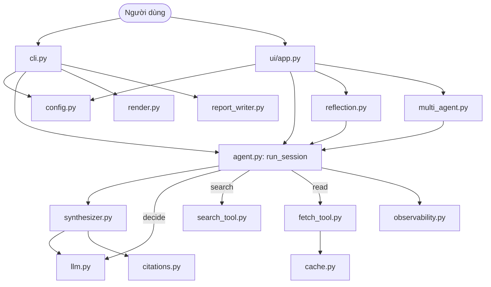
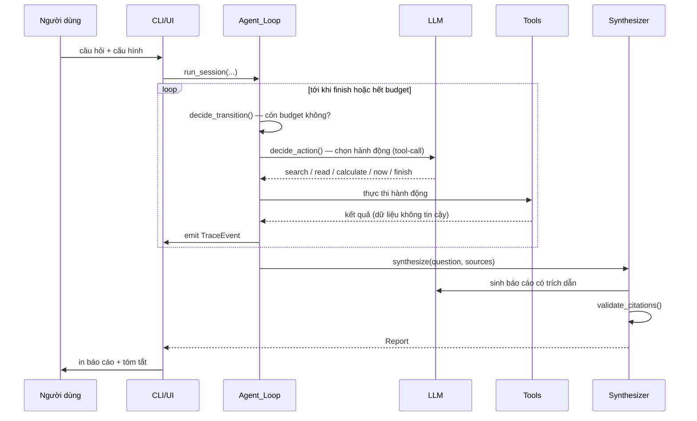
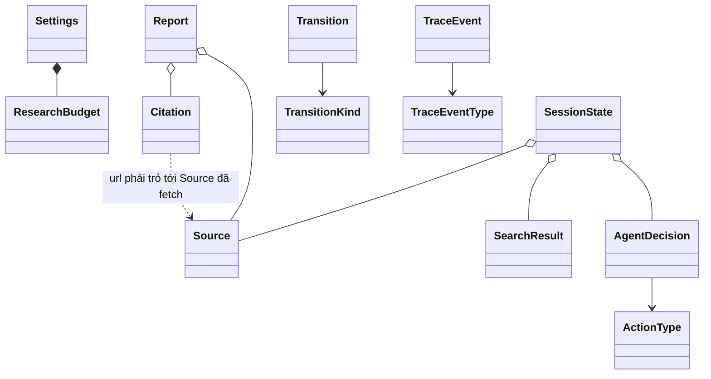

# Tài liệu kỹ thuật — Research Agent

> Tài liệu này mô tả **toàn bộ** kiến trúc, thành phần, luồng dữ liệu và quyết
> định thiết kế của dự án `research-agent`. Dành cho người muốn hiểu sâu cách hệ
> thống hoạt động, bảo trì, hoặc mở rộng nó.

---

## Mục lục

1. [Tổng quan](#1-tổng-quan)
2. [Triết lý thiết kế](#2-triết-lý-thiết-kế)
3. [Kiến trúc tổng thể](#3-kiến-trúc-tổng-thể)
4. [Luồng chạy một phiên nghiên cứu](#4-luồng-chạy-một-phiên-nghiên-cứu)
5. [Chi tiết từng module](#5-chi-tiết-từng-module)
6. [Mô hình dữ liệu](#6-mô-hình-dữ-liệu)
7. [Ba chế độ nghiên cứu](#7-ba-chế-độ-nghiên-cứu)
8. [Hệ thống công cụ (tools)](#8-hệ-thống-công-cụ-tools)
9. [Xử lý lỗi & độ bền](#9-xử-lý-lỗi--độ-bền)
10. [Bảo mật](#10-bảo-mật)
11. [Cấu hình](#11-cấu-hình)
12. [Giao diện web](#12-giao-diện-web)
13. [Kiểm thử](#13-kiểm-thử)
14. [Cách mở rộng](#14-cách-mở-rộng)
15. [Thuật ngữ](#15-thuật-ngữ)

---

## 1. Tổng quan

**Research Agent** là một AI agent tự chủ: nhận một câu hỏi, tự thực hiện nhiều
vòng tìm kiếm web, đọc nguồn, suy luận khi nào đủ thông tin, rồi viết một báo cáo
Markdown **có trích dẫn**.

- **Ngôn ngữ:** Python 3.11+
- **Giao diện:** CLI (`research-agent`) và Web UI (Streamlit)
- **LLM:** bất kỳ API tương thích OpenAI (Groq, Gemini, OpenAI, Ollama...)
- **Tìm kiếm:** DuckDuckGo (miễn phí) + Tavily (tùy chọn), có fallback tự động
- **Phụ thuộc lõi:** `httpx`, `trafilatura`, `ddgs` (xuất tùy chọn: `fpdf2` cho PDF, `python-docx` cho Word)
- **Kiểm thử:** `pytest` + `hypothesis` (262 test, gồm 10 property-based)
- **Chất lượng:** `ruff` (lint) + `mypy` (type-check), CI trên GitHub Actions

Hai mục tiêu xuyên suốt:
1. **Công cụ dùng được thật** — ổn định, có giới hạn chi phí, xử lý lỗi an toàn.
2. **Phương tiện học AI agent** — mỗi khái niệm cốt lõi (tool-calling, vòng lặp
   suy luận, tổng hợp, xử lý nguồn không tin cậy) tách thành thành phần rõ ràng.

---

## 2. Triết lý thiết kế

Bốn nguyên tắc chi phối toàn bộ mã nguồn:

### 2.1. Tách lõi xác định khỏi I/O bất định
Mọi logic điều khiển (vòng lặp, ép giới hạn budget, kiểm tra trích dẫn, cắt nội
dung, lọc domain, đếm retry) là **hàm thuần** — không gọi mạng, không phụ thuộc
thời gian. Phần bất định (gọi LLM, search, fetch, ghi file) bị đẩy ra **lớp biên**
(boundary) sau các interface. Nhờ vậy lõi dễ đọc, dễ test bằng property-based.

### 2.2. Mọi nội dung từ web là DỮ LIỆU, không phải CHỈ THỊ
Nội dung trang web và kết quả tìm kiếm luôn được bọc trong ranh giới
`wrap_untrusted` rồi mới đưa vào LLM, không bao giờ nối vào vùng chỉ thị hệ thống.
Đây là phòng tuyến chống **prompt injection**.

### 2.3. Agent LUÔN dừng
Mọi vòng lặp bị ràng buộc bởi `ResearchBudget` (số vòng / số nguồn / thời gian)
với giá trị mặc định hữu hạn. Kể cả khi LLM không bao giờ chủ động "finish",
phiên vẫn kết thúc.

### 2.4. Quan sát được theo mặc định
Mỗi quyết định và hành động phát ra một `TraceEvent`. CLI in ra terminal, Web UI
hiển thị tiếng Việt theo thời gian thực — để người dùng "thấy agent đang nghĩ gì".

---

## 3. Kiến trúc tổng thể

Hệ thống chia làm ba lớp:

```
┌─────────────────────────────────────────────────────────┐
│  LỚP GIAO DIỆN / CẤU HÌNH                                 │
│  cli.py · ui/app.py · config.py                           │
└─────────────────────────────────────────────────────────┘
                          │
┌─────────────────────────────────────────────────────────┐
│  LỚP ĐIỀU PHỐI (lõi xác định)                             │
│  agent.py · synthesizer.py · reflection.py ·              │
│  multi_agent.py · citations.py · render.py · evaluate.py  │
└─────────────────────────────────────────────────────────┘
                          │  (phụ thuộc qua interface)
┌─────────────────────────────────────────────────────────┐
│  LỚP BIÊN (I/O bất định)                                  │
│  llm.py · search_tool.py · fetch_tool.py · cache.py ·     │
│  report_writer.py · observability.py                      │
└─────────────────────────────────────────────────────────┘
```

Lớp điều phối chỉ phụ thuộc vào **interface** (`typing.Protocol`) của lớp biên,
nên có thể thay thế/mock dễ dàng khi test.

### Sơ đồ thành phần



---

## 4. Luồng chạy một phiên nghiên cứu

Với chế độ **Thường** (`run_session`):



**Các bước cụ thể trong vòng lặp (`run_session`):**

1. `decide_transition(state, budget, now)` — hàm thuần kiểm tra: nếu LLM đã chọn
   FINISH, hoặc đạt `max_rounds` / `max_sources` / `max_seconds` → chuyển sang
   tổng hợp. Ngược lại tiếp tục.
2. (Tùy chọn) chờ `round_delay_seconds` để tránh chạm rate limit.
3. `_next_valid_decision()` — gọi LLM chọn hành động; nếu phản hồi sai định dạng,
   yêu cầu lại tới `max_llm_attempts` lần.
4. Thực thi hành động:
   - **SEARCH** → `search.search(query)`, lưu kết quả vào `search_results`.
   - **READ** → `fetch.fetch(url)`; chống đọc trùng, cap per-domain, tự thay nguồn
     nếu URL lỗi/đã đọc.
   - **CALCULATE** → tính toán an toàn, lưu kết quả vào `tool_notes`.
   - **NOW** → lấy ngày giờ, lưu vào `tool_notes`.
   - **FINISH** → nếu chưa đủ domain, tự đọc thêm 1 nguồn mới (ràng buộc mềm).
5. Tăng `rounds_used`, phát `TraceEvent` hoàn tất vòng.
6. Khi thoát vòng lặp → `synthesize_fn(question, sources, llm)` tạo báo cáo.

---

## 5. Chi tiết từng module

### `models.py` — Mô hình dữ liệu
Toàn bộ value object bất biến (`@dataclass(frozen=True)`): `Settings`,
`ResearchBudget`, `SearchResult`, `Source`, `AgentDecision`, `InvalidDecision`,
`Citation`, `Report`, `Transition`, `TraceEvent`. `SessionState` khả biến để
tích lũy tiến trình. Các `Enum`: `ActionType`, `TransitionKind`, `TraceEventType`.

### `config.py` — Phân giải cấu hình
`resolve_settings(env, cli_overrides, defaults)` là **hàm thuần** gộp cấu hình
theo thứ tự ưu tiên **CLI > biến môi trường > mặc định** thành `Settings` bất
biến. Ném `ConfigError` nếu thiếu API key. `Defaults` chứa giá trị mặc định hữu
hạn cho mọi tùy chọn.

### `cli.py` — Giao diện dòng lệnh
`main(argv)` điều phối: phân giải cấu hình → đọc câu hỏi → dựng LLM/search/fetch
→ chạy chế độ tương ứng → render Markdown → ghi file → in tóm tắt. `is_valid_question`
và `read_question` xử lý đầu vào. `_force_utf8_output()` ép UTF-8 cho console
Windows. Mã thoát: 0 (OK), 2 (config), 3 (LLM), 4 (ghi file).

### `content.py` — Hàm thuần xử lý nội dung
- `truncate_content(text, max_chars)` — cắt nội dung theo giới hạn.
- `is_blocked(url, blocked_domains)` — True nếu host khớp/là subdomain domain bị chặn.
- `wrap_untrusted(source_text)` — bọc nội dung trong ranh giới sentinel chống injection.
- `host_of(url)` — lấy host (dùng cho logic đa dạng nguồn).

### `llm.py` — Lớp biên LLM
- `LLMProvider` (Protocol): `decide_action`, `generate`.
- `OpenAICompatibleProvider` — client httpx gọi API tương thích OpenAI; hỗ trợ
  **native tool-calling** (`tool_choice="auto"`), streaming (`generate_stream`),
  và ghi token usage.
- `_recover_from_failed_generation` — phục hồi quyết định khi model open-source
  trả tool-call sai định dạng (vd `<function=...>` của Llama trên Groq).
- `parse_retry_after` / `parse_retry_after_from_body` — đọc thời gian chờ retry
  từ header hoặc body lỗi (Gemini để hint trong body).

### `retry.py` — Logic thử lại
- `should_retry`, `next_delay` (thuần) — chính sách đếm & tính thời gian chờ
  (exponential backoff, tôn trọng `retry_after`).
- `call_with_retry` — gọi hàm, thử lại chỉ với lỗi tạm thời, tối đa N lần.
- `RetryingLLMProvider` — decorator bọc một `LLMProvider`, thêm retry cho cả
  `decide_action`, `generate`, `generate_stream`.

### `search_tool.py` — Tìm kiếm web
- `SearchTool` (Protocol), `SearchOutcome` (kết quả hoặc lỗi).
- `parse_search_results` (thuần) — chuẩn hóa JSON nhiều định dạng API.
- `DuckDuckGoSearchTool` (miễn phí), `TavilySearchTool` (cần key),
  `HttpSearchTool` (endpoint tùy chỉnh).
- `FallbackSearchTool` — thử nhiều provider theo thứ tự, tự chuyển khi lỗi/rỗng.

### `fetch_tool.py` — Tải & trích xuất nội dung
- `FetchTool` (Protocol), `FetchOutcome`.
- `HttpFetchTool` — chặn URL bị block trước khi gọi mạng, tải bằng httpx (có
  User-Agent để tránh bị chặn), trích xuất văn bản chính bằng trafilatura, cắt
  theo giới hạn, bắt lỗi mạng/HTTP/SSL an toàn.

### `cache.py` — Bộ nhớ đệm fetch
- `cache_key`, `is_fresh` (thuần).
- `FetchCache` — lưu nội dung theo URL ra file JSON (dùng lại giữa các phiên).
- `CachingFetchTool` — bọc một `FetchTool`, phục vụ cache hit, lưu cache miss.

### `prefetch.py` — Tải trước song song
`select_prefetch_urls` (thuần) chọn các URL kết quả đáng tải trước (tôn trọng
giới hạn per-domain, bỏ URL đã đọc/lỗi). `prefetch_urls` tải đồng thời bằng
`ThreadPoolExecutor` để làm nóng cache → các lượt READ sau là cache hit, giảm
thời gian phiên. Bật/tắt qua `--prefetch N`.

### `llm_cache.py` — Cache phản hồi LLM (tùy chọn)
`llm_cache_key` (thuần) băm (model, messages, tools). `LLMResponseCache` lưu
quyết định/văn bản ra đĩa. `CachingLLMProvider` bọc một `LLMProvider`, phục vụ
phản hồi đã cache cho prompt giống hệt (bật bằng `--cache-llm`; mặc định tắt).

### `recency.py` — Nhận diện câu hỏi thời sự
`wants_recency` (thuần) phát hiện từ khóa thời sự (Anh/Việt) hoặc năm gần đây;
`recency_directive` trả về chỉ thị tin cậy hướng agent tới nguồn mới + công cụ
`now`/`get_news`.

### `chat.py` — Hỏi nối tiếp trên CLI (`--chat`)
`build_chat_messages` (thuần) lắp thông điệp grounded trên báo cáo + lịch sử hội
thoại; `run_chat_loop` chạy vòng hỏi-đáp với I/O tiêm vào (test được không cần
terminal thật).

### `decision.py` — Phân giải quyết định
`parse_decision(raw)` (thuần) — kiểm tra phản hồi LLM có đúng cấu trúc hành động
không (đủ tham số bắt buộc), trả `AgentDecision` hoặc `InvalidDecision`.

### `tools.py` — Schema công cụ
`TOOL_SCHEMAS` — đặc tả các công cụ (search/read/finish/calculate/now/
get_weather/get_stock/get_wikipedia/arxiv_search/convert/get_news/get_github/
read_pdf) ở định dạng function-calling chuẩn OpenAI/Gemini.

### `calculator.py` — Công cụ tính toán an toàn
`calculate(expression)` — đánh giá biểu thức số học bằng AST với **allow-list**
toán tử, **không dùng `eval`**, chặn tên biến/gọi hàm/số mũ quá lớn. `now_str` —
ngày giờ hiện tại.

### `stock.py` — Công cụ chứng khoán
Lấy giá mới nhất từ endpoint công khai của Yahoo Finance (không cần API key, như
cách công cụ thời tiết dùng wttr.in). `normalize_symbol`, `parse_yahoo_chart`,
`format_stock_quote` là **hàm thuần** (test không cần mạng); chỉ
`fetch_stock_quote` thực hiện lời gọi HTTP.

### `wikipedia.py` — Công cụ Wikipedia
Lấy đoạn tóm tắt (lead extract) của bài Wikipedia khớp nhất qua MediaWiki API
(không cần key). `normalize_topic`, `wikipedia_query_params`,
`parse_wikipedia_response`, `format_article` là **hàm thuần**; chỉ
`fetch_wikipedia` gọi HTTP.

### `arxiv.py` — Công cụ arXiv
Tìm bài báo học thuật qua Atom API của arXiv (không cần key). `normalize_query`,
`parse_arxiv_atom`, `format_papers` là **hàm thuần** (test bằng fixture XML); chỉ
`fetch_arxiv` gọi HTTP.

### `convert.py` — Chuyển đổi đơn vị & tiền tệ
Bổ trợ cho calculator. Đổi đơn vị vật lý (xác định, thuần) và tiền tệ (tỷ giá ECB
trực tiếp qua Frankfurter, không cần key). `parse_conversion`, `convert_units`,
`is_currency` là **hàm thuần**; chỉ `fetch_currency` gọi mạng.

### `news.py` — Tin tức gần đây
Tìm tin/bài qua Hacker News (Algolia API, không cần key). `parse_hn_results`,
`format_news` là **hàm thuần**; chỉ `fetch_news` gọi HTTP.

### `github.py` — Tra cứu kho GitHub
Lấy metadata repo công khai (sao, ngôn ngữ, giấy phép, bản phát hành mới) qua
GitHub REST API. `normalize_repo`, `parse_repo`, `parse_release`, `format_repo`
là **hàm thuần**; chỉ `fetch_github` gọi HTTP.

### `weather.py` — Công cụ thời tiết
`fetch_weather(location)` lấy thời tiết hiện tại từ wttr.in (không cần key); chỉ
phần gọi HTTP, không có logic thuần phức tạp.

### `tool_registry.py` — Sổ đăng ký công cụ info
`InfoTool` mô tả khai báo một công cụ "một-tham-số → một Source" (tên, ActionType,
trường tham số, schema, hàm `fetch`, loại lỗi). `INFO_TOOLS` liệt kê 6 công cụ
(weather/stock/wikipedia/arxiv/news/github). Nhờ đó schema (`tools.py`), phân
giải (`decision.py`) và dispatch (`agent.py`) được định nghĩa **một chỗ** thay vì
lặp ở ba nơi.

### `source_quality.py` — Xếp hạng độ tin cậy nguồn (mở rộng được)
Heuristic minh bạch (không phải fact-check): `assess_source` chấm điểm theo loại
domain — ưu tiên official `.gov`/`.edu`/`.int`, rồi tập nguồn uy tín đã tuyển
chọn (hãng tin lớn, bách khoa, nhà xuất bản học thuật), trên web thường, dưới
mạng xã hội — cộng với lượng bằng chứng trích xuất được. `rank_search_results`
sắp xếp kết quả theo điểm. Có thể **mở rộng** danh sách uy tín bằng file JSON qua
`load_reputation_file` / `configure_reputation_from_file` (`--reputation-file`),
bổ sung lên trên các mặc định dựng sẵn.

### `memory.py` — Bộ nhớ dài hạn (`--memory`)
Lưu nghiên cứu cũ (câu hỏi + tóm tắt + URL nguồn) ra file JSON. `tokenize`,
`relevance_score`, `select_relevant`, `summarize_for_memory`,
`format_memory_directive` là **hàm thuần**; chỉ `MemoryStore` chạm đĩa (giống
`FetchCache`). Trước mỗi phiên, các bản ghi liên quan nhất được gợi lại làm ngữ
cảnh **tin cậy**; sau phiên, kết quả được ghi nhớ.

### `pdf_export.py` — Xuất PDF trực tiếp
`markdown_to_blocks` / `strip_inline_markdown` phân tích Markdown thành block
(thuần). `render_pdf_bytes` dựng PDF bằng `fpdf2` với font Unicode tự tìm trên
máy (để tiếng Việt hiển thị đúng); nếu thiếu `fpdf2` hoặc font thì ném
`PdfExportError` để nơi gọi quay về xuất Markdown/HTML.

### `docx_export.py` — Xuất Word (.docx)
`render_docx_bytes` dùng lại `markdown_to_blocks` (thuần) rồi dựng tài liệu Word
bằng `python-docx` (Word hỗ trợ Unicode sẵn nên tiếng Việt hiển thị đúng). Thiếu
gói thì ném `DocxExportError` để quay về định dạng khác.

### `agent.py` — Bộ điều phối (Agent_Loop)
- `decide_transition` (thuần) — quyết định tiếp tục hay tổng hợp (Property 8).
- `build_messages` (thuần) — lắp ráp thông điệp, bọc nguồn trong `wrap_untrusted`.
- `should_allow_finish`, `next_diversity_url`, `count_distinct_domains` (thuần) —
  logic đa dạng nguồn.
- `run_session` — vòng lặp I/O chính.

### `synthesizer.py` — Tổng hợp báo cáo
- `synthesize` — gọi LLM sinh báo cáo có trích dẫn từ nguồn; nếu không có nguồn
  trả báo cáo "không tìm thấy thông tin" (không bịa).
- `synthesize_stream` — phiên bản streaming, yield từng đoạn rồi trả `Report`.
- Hỗ trợ tham số `language` để ép ngôn ngữ báo cáo, và `style` (brief/standard/
  deep) để điều chỉnh độ dài & độ sâu (`style_instruction` là hàm thuần).

### `citations.py` — Toàn vẹn trích dẫn
`validate_citations(report, sources)` (thuần) — loại bỏ mọi trích dẫn không trỏ
tới nguồn đã thực sự fetch (Property 5).

### `render.py` — Dựng Markdown
`render_markdown(report)` (thuần) — dựng báo cáo Markdown + mục Sources liệt kê
mọi URL nguồn (Property 6).

### `report_writer.py` — Ghi file
`write_report(markdown, path)` — ghi file, ném `ReportWriteError` khi thất bại.

### `observability.py` — Quan sát
- `render_trace` (thuần) — dựng dòng mô tả một sự kiện.
- `format_budget_progress` (thuần) — dòng tiến độ so với budget (vòng/nguồn).
- `TraceEmitter` — in ra stream (kèm tiến độ budget khi `-v`);
  `CollectingEmitter` — thu vào list + callback (cho UI).

### `reflection.py` — Tự đánh giá
- `critique_report` — LLM chấm điểm báo cáo, liệt kê gap + truy vấn bổ sung.
- `parse_critique`, `decide_reflection`, `format_directive` (thuần).
- `run_with_reflection` — vòng lặp: nghiên cứu → chấm → nếu thiếu thì nghiên cứu
  thêm, tối đa `max_iterations`.

### `multi_agent.py` — Đa agent
- `make_plan` (Planner) — chia câu hỏi thành sub-question.
- `parse_plan`, `dedupe_sources` (thuần).
- `run_multi_agent` — Planner → nhiều Researcher (mỗi sub-question chạy
  `run_session`) → Writer (gộp nguồn, tổng hợp).

### `usage.py` — Đếm token & chi phí
`UsageTracker` tích lũy token, `estimate_cost` ước tính chi phí, `format_usage`
hiển thị.

### `evaluate.py` — Đánh giá
`evaluate_report` đo chỉ số khách quan (số nguồn, domain, trích dẫn, grounded,
điểm chất lượng nguồn trung bình), `aggregate` tính trung bình một chế độ.
`evaluate_modes` chạy nhiều chế độ trên cùng bộ câu hỏi, `compare_modes` +
`format_comparison_markdown` dựng bảng so sánh. Có console script
`research-agent-eval` để benchmark nhanh. Ngoài chỉ số khách quan, có thêm
`llm_quality_score` (+`parse_quality_judgement`) cho điểm chất lượng chủ quan do
LLM chấm (0–10) khi cần.

### `errors.py` — Ngoại lệ
`ResearchAgentError` (gốc), `ConfigError`, `ReportWriteError`, `LLMError`.

---

## 6. Mô hình dữ liệu



**Các trường chính:**

| Model | Trường nổi bật |
|---|---|
| `Settings` | api_key, base_url, model, blocked_domains, per_source_char_limit, max_llm_attempts, budget, min_domains, max_per_domain, cache_dir, cache_ttl, round_delay_seconds |
| `ResearchBudget` | max_rounds (8), max_sources (12), max_seconds (180) |
| `SearchResult` | title, url, snippet |
| `Source` | url, content, fetched_at |
| `AgentDecision` | action, reasoning, query, url, expression, path, location, symbol, topic, paper_query, conversion, news_query, repo |
| `Citation` | claim_ref, url |
| `Report` | question, body_markdown, citations, sources, no_information |
| `SessionState` | question, rounds_used, sources, search_results, search_history, failed_urls, tool_notes, ... |

---

## 7. Ba chế độ nghiên cứu

| Chế độ | Hàm | Mô tả | Số lệnh gọi LLM |
|---|---|---|---|
| **Thường** | `run_session` | Tìm → đọc → viết. | Ít nhất |
| **Tự đánh giá** | `run_with_reflection` | Sau khi viết, agent tự chấm điểm, tìm gap, nghiên cứu thêm tới khi đạt điểm hoặc hết `max_iterations`. | Trung bình |
| **Đa agent** | `run_multi_agent` | Planner chia câu hỏi → nhiều Researcher → Writer tổng hợp. | Nhiều nhất |

Cả ba dùng chung `run_session` làm lõi, nên mọi tính năng (cache, đa dạng nguồn,
tool, độ trễ) áp dụng đồng nhất.

---

## 8. Hệ thống công cụ (tools)

Agent chọn 1 trong các công cụ mỗi bước qua **native function-calling**:

| Tool | Tham số | Tác dụng |
|---|---|---|
| `search` | query | Tìm web |
| `read` | url | Tải & đọc một trang |
| `calculate` | expression | Tính toán số học chính xác (an toàn, không eval) |
| `now` | — | Lấy ngày giờ hiện tại |
| `get_weather` | location | Lấy thời tiết hiện tại (wttr.in) |
| `get_stock` | symbol | Lấy giá cổ phiếu/chỉ số mới nhất (Yahoo Finance, không cần key) |
| `get_wikipedia` | topic | Tra tóm tắt bách khoa của một chủ đề (MediaWiki API, không cần key) |
| `arxiv_search` | query | Tìm bài báo học thuật trên arXiv (Atom API, không cần key) |
| `convert` | expression | Đổi đơn vị/tiền tệ (vd '100 USD to EUR') |
| `get_news` | query | Tìm tin gần đây (Hacker News, không cần key) |
| `get_github` | repo | Tra metadata kho GitHub (REST API) |
| `read_pdf` | path | Đọc đúng PDF người dùng đã chỉ định cho phiên |
| `finish` | — | Dừng và tổng hợp |

**Điểm học quan trọng:** hệ thống không hard-code "khi nào dùng tool nào". LLM tự
quyết định dựa trên schema (`tools.py`). Muốn thêm khả năng cho agent, chỉ cần
thêm 1 schema + 1 nhánh xử lý — xem [mục 14](#14-cách-mở-rộng).

---

## 9. Xử lý lỗi & độ bền

| Tình huống | Phân loại | Hành vi |
|---|---|---|
| Thiếu API key | Không khôi phục | ConfigError, thoát mã 2 |
| Search lỗi | Khôi phục | Trả lỗi mô tả, phiên tiếp tục |
| Fetch lỗi (mạng/403/SSL) | Khôi phục | Ghi TOOL_ERROR, tự chuyển nguồn khác |
| URL bị chặn | Khôi phục | Bỏ qua, không gọi mạng |
| LLM lỗi tạm thời (429/5xx/timeout) | Khôi phục | Thử lại tới `max_llm_attempts`, tôn trọng Retry-After |
| LLM lỗi sau N lần | Không khôi phục | LLMError, thoát mã 3 |
| LLM trả tool-call sai định dạng | Khôi phục | Phục hồi từ failed_generation, hoặc yêu cầu lại |
| Ghi file lỗi | Không khôi phục | ReportWriteError, thoát mã 4 |
| Không thu được nguồn nào | Khôi phục | Báo cáo "không tìm thấy thông tin" |

**Cơ chế chống lặp vô ích:** đọc trùng URL, cap số trang/domain, tự thay nguồn
khi URL lỗi/đã đọc — tránh agent "kẹt" chọn mãi một URL.

**Chống rate limit (429):** `round_delay_seconds` giãn các vòng; backoff tôn
trọng thời gian server yêu cầu (cả trong header lẫn body lỗi).

---

## 10. Bảo mật

- **Prompt injection:** mọi nội dung web bọc trong `wrap_untrusted`; sentinel
  trong nội dung nguồn bị vô hiệu hóa để không "phá ranh giới".
- **Tính toán an toàn:** `calculator.py` dùng AST allow-list, không `eval` —
  không thể chạy mã tùy ý từ output của model.
- **API key:** lưu trong `.env` (đã `.gitignore`), không commit. Web UI nhập key
  dạng password, chỉ ghi đĩa khi bấm "Lưu cấu hình".
- **Lọc domain:** `blocked_domains` chặn fetch các domain không mong muốn.

---

## 11. Cấu hình

Biến môi trường (hoặc đặt qua `.env` / cờ CLI):

| Biến | Mặc định | Ý nghĩa |
|---|---|---|
| `RESEARCH_AGENT_API_KEY` | (bắt buộc) | Khóa API LLM |
| `RESEARCH_AGENT_BASE_URL` | api.openai.com/v1 | Endpoint API |
| `RESEARCH_AGENT_MODEL` | gpt-4o-mini | Tên model |
| `RESEARCH_AGENT_TAVILY_API_KEY` | — | Bật Tavily search |
| `RESEARCH_AGENT_BLOCKED_DOMAINS` | — | Danh sách domain chặn (phân cách dấu phẩy) |
| `RESEARCH_AGENT_MAX_ROUNDS` | 8 | Số vòng tối đa |
| `RESEARCH_AGENT_MAX_SOURCES` | 12 | Số nguồn tối đa |
| `RESEARCH_AGENT_MAX_SECONDS` | 180 | Thời gian tối đa |
| `RESEARCH_AGENT_PER_SOURCE_CHARS` | 12000 | Ký tự tối đa mỗi nguồn |
| `RESEARCH_AGENT_MAX_LLM_ATTEMPTS` | 3 | Số lần thử lại LLM |
| `RESEARCH_AGENT_MIN_DOMAINS` | 2 | Số domain tối thiểu (ràng buộc mềm) |
| `RESEARCH_AGENT_MAX_PER_DOMAIN` | 2 | Số trang tối đa mỗi domain |
| `RESEARCH_AGENT_CACHE_DIR` | .research_agent_cache | Thư mục cache |
| `RESEARCH_AGENT_CACHE_TTL` | 0 (vô hạn) | TTL cache (giây) |
| `RESEARCH_AGENT_ROUND_DELAY` | 0 | Độ trễ giữa các vòng (giây) |
| `RESEARCH_AGENT_STYLE` | standard | Độ dài báo cáo: brief / standard / deep |
| `RESEARCH_AGENT_PREFETCH` | 3 | Số kết quả tải trước song song (0 = tắt) |
| `RESEARCH_AGENT_REPUTATION_FILE` | — | File JSON bổ sung domain uy tín/kém |

Thứ tự ưu tiên: **cờ CLI > biến môi trường > mặc định**.

---

## 12. Giao diện web

File `ui/app.py` (Streamlit) + `ui/helpers.py`. Tái dùng 100% lõi, chỉ thêm lớp UI.

**Tính năng:**
- Chọn nhà cung cấp (Groq/Gemini/OpenAI/tùy chỉnh), lưu cấu hình ra `.env`.
- Chọn chế độ + ngôn ngữ báo cáo (Việt/Anh/tự động).
- **Giao diện song ngữ** (Việt/Anh) qua `ui/i18n.py` — đổi ở đầu thanh bên.
- Toggles nâng cao: tải-trước song song, cache LLM, ưu tiên tin mới (recency).
- Các thanh trượt giới hạn + độ trễ chống 429.
- Hiển thị các bước agent theo thời gian thực (Việt/Anh).
- **Streaming** báo cáo (chế độ Thường) — chữ chạy dần.
- Xem trước nội dung từng nguồn; chat hỏi tiếp dựa trên báo cáo.
- **So sánh nhiều model song song**: chạy cùng câu hỏi qua 2–4 model và hiển thị
  báo cáo + chỉ số (`evaluate_report`) cạnh nhau.
- Lịch sử lâu dài (lưu `.research_agent_history.json`).
- Xuất Markdown / HTML / **PDF trực tiếp** (qua `pdf_export`) / **Word .docx**
  (qua `docx_export`), đều dự phòng về định dạng khác nếu thiếu gói/font.
- Hiển thị token usage + chi phí ước tính.

Khởi động: `.\run-ui.ps1` hoặc `streamlit run ui/app.py`.

---

## 13. Kiểm thử

262 test, chia làm:
- **Property-based** (`test_properties.py`, dùng `hypothesis`, ≥100 ví dụ): 10
  thuộc tính đúng đắn của lõi xác định (validate input, cắt nội dung, lọc domain,
  cô lập injection, toàn vẹn trích dẫn, liệt kê nguồn, phân giải config, chuyển
  trạng thái + bảo đảm dừng, giới hạn retry, render trace).
- **Unit** (`test_units.py`, `test_calculator.py`, `test_usage.py`,
  `test_evaluate.py`, `test_stock.py`, `test_memory.py`, `test_pdf_export.py`,
  `test_source_quality.py`, `test_report_style.py`, `test_docx_export.py`,
  `test_wikipedia.py`, `test_arxiv.py`, `test_convert.py`, `test_news.py`,
  `test_github.py`, `test_prefetch.py`, `test_llm_cache.py`, `test_recency.py`,
  `test_reputation.py`, `test_tool_io.py`, `test_chat.py`, `test_progress.py`,
  `test_ui_helpers.py`, `test_ui_i18n.py`): ví dụ/biên/lỗi cho từng thành phần.
- **Tích hợp** (`test_integration.py`): trích xuất HTML, smoke end-to-end,
  hồi quy injection.
- **Theo chế độ** (`test_reflection.py`, `test_multi_agent.py`,
  `test_enhancements.py`): reflection, multi-agent, cache/diversity/backoff.

Chạy: `pytest` (262 test) · Lint: `ruff check src tests` · Type: `mypy src`

---

## 14. Cách mở rộng

### Thêm một công cụ "info" một-tham-số (cách nhanh nhất)
Với công cụ chỉ nhận một chuỗi và trả về một nguồn (như stock/wikipedia/news):
1. Viết `fetch_X(arg, *, ...) -> (url, content)` trong một module mới, raise một
   `XError` riêng.
2. Thêm giá trị vào `ActionType` (`models.py`) + một trường tham số vào
   `AgentDecision` nếu cần.
3. Thêm một `InfoTool(...)` vào `INFO_TOOLS` trong `tool_registry.py`.
4. (Tùy chọn) cập nhật `render_step_vi` trong `ui/app.py` để hiển thị tiếng Việt.
5. Viết test (parser thuần + nhánh I/O bằng cách patch `httpx.get`).

Schema, phân giải quyết định và dispatch được sinh **tự động** từ registry —
không cần sửa `tools.py`, `decision.py`, hay `agent.py`.

### Thêm một công cụ có hình dạng đặc biệt (ví dụ: đọc PDF)
1. Thêm schema vào `CORE_TOOL_SCHEMAS` trong `tools.py`.
2. Thêm giá trị vào `ActionType` (`models.py`) và xử lý trong `parse_decision`
   (`decision.py`).
3. Thêm nhánh xử lý trong vòng lặp `run_session` (`agent.py`), lưu kết quả vào
   `state.tool_notes` hoặc `state.sources`.
4. (Tùy chọn) cập nhật `render_step_vi` trong `ui/app.py`.
5. Viết test.

### Thêm một search provider mới
1. Tạo class mới trong `search_tool.py` hiện thực `SearchTool` (method `search`
   trả `SearchOutcome`).
2. Thêm vào chuỗi `FallbackSearchTool` trong `cli.py` / `ui/app.py`.

### Đổi LLM provider
Chỉ cần đổi `RESEARCH_AGENT_BASE_URL` + `RESEARCH_AGENT_MODEL` (bất kỳ API tương
thích OpenAI). Không cần sửa code.

---

## 15. Thuật ngữ

- **Agent loop:** vòng lặp suy luận đa bước, mỗi bước agent chọn một hành động.
- **Tool-calling / function-calling:** cơ chế LLM trả về lời gọi công cụ có cấu
  trúc thay vì văn bản tự do.
- **Reflection:** agent tự đánh giá kết quả của chính nó rồi cải thiện.
- **Multi-agent:** nhiều agent chuyên biệt phối hợp (planner/researcher/writer).
- **Grounding / citation:** gắn mỗi khẳng định với nguồn thực để kiểm chứng được.
- **Prompt injection:** tấn công nhúng chỉ thị độc hại vào nội dung để chiếm
  quyền điều khiển agent.
- **Property-based testing:** kiểm thử bằng cách phát biểu thuộc tính phải luôn
  đúng, rồi chạy với hàng trăm đầu vào sinh ngẫu nhiên.
- **Budget:** tập giới hạn (vòng/nguồn/thời gian) đảm bảo phiên luôn kết thúc.

---

*Tài liệu này mô tả trạng thái dự án tại thời điểm viết. Khi sửa code, hãy cập
nhật tài liệu tương ứng. Xem thêm `README.md` (tổng quan tiếng Anh) và
`HUONG_DAN.md` (hướng dẫn sử dụng tiếng Việt).*
